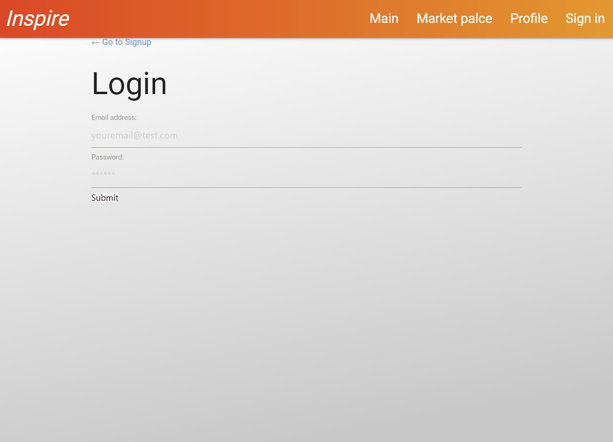
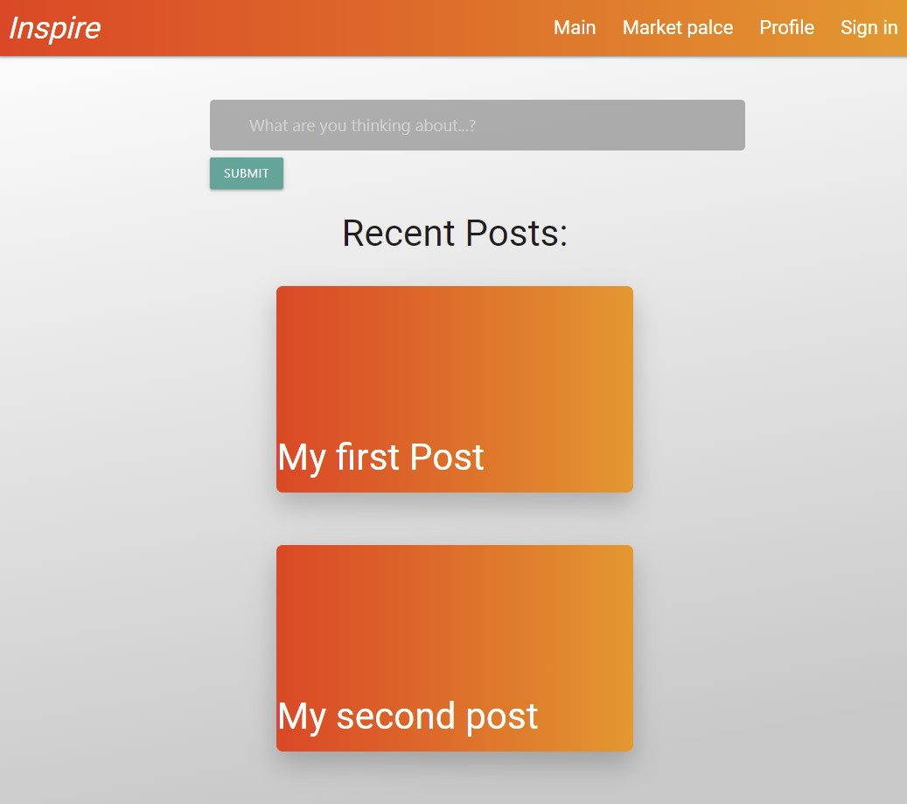
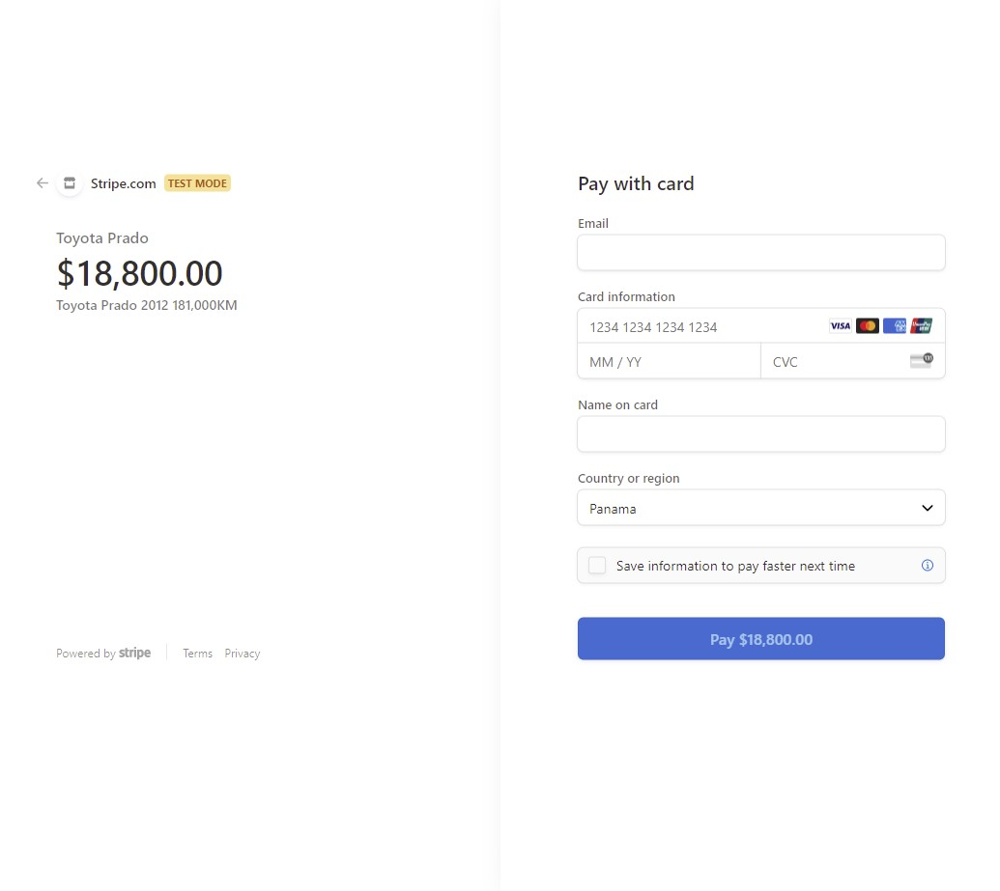

# Inspire
## Description
Inspire is a social network that allows users to post, see other users' posts, and buy items in the marketplace. This app allows users to post what they are doing or what's on their mind with text-only in a quick and simple way. Users are also able to enter the marketplace, browse available items and purchase what they want. This application is integrated in [Stripe](https://stripe.com/) for easy payment.
## Table of Contents
- [Installation](#installation)
- [Usage](#usage)
- [Deployment](#deployment)
- [Technologies](#technologies)
- [Future Development](#future-development)
- [Screenshots and Demo](#screenshots-and-demo)
- [Contributors](#contributors)
- [License](#license)
   
## Installation
To install the necessary packages, open the terminal and run `npm install`. To deploy application locally, run `npm run develop` on the terminal.
## Usage  
* This app can be accessed from any browser on computer, ipad, or mobile phone.
* Users can login or signup.
* Users can create text-only posts.
* Users can view other users' post.
* Users can visit and browse the marketplace.
* Users can add items to their cart.
* Users can purchase items in cart using stripe.
## Deployment
<!-- Agregar heroku -->
* [Deployed App]()
* [Github Repository](https://github.com/stamm2911/Inspire)

## Technologies
* [MongoDB](https://www.mongodb.com/) is a source-available cross-platform document-oriented database program. Classified as a NoSQL database program, MongoDB uses JSON-like documents with optional schemas.
* [Express](https://expressjs.com/)  is a back end web application framework for Node.js. It is designed for building web applications and APIs.
* [React](https://reactjs.org/) is a free and open-source front-end JavaScript library for building user interfaces or UI components.
* [Node.js](https://nodejs.org/) is an open-source, cross-platform, back-end JavaScript runtime environment that runs on the V8 engine and executes JavaScript code outside a web browser.
* [GraphQL](https://graphql.org/) is an open-source data query and manipulation language for APIs, and a runtime for fulfilling queries with existing data.
* [Stripe](https://stripe.com/) is a JavaScript library which you can wire into your checkout form to handle the credit card information.
* [Mongoose](https://mongoosejs.com/) provides a straight-forward, schema-based solution to model your application data. It includes built-in type casting, validation, query building, business logic hooks and more, out of the box.
* [Materialize](https://materializecss.com/) is a modern responsive CSS framework based on Material Design by Google.
* [Heroku](https://www.heroku.com/) is a platform as a service (PaaS) that enables developers to build, run, and operate applications entirely in the cloud.

## Future Development
* Create profile pages that contain demographic information of the users and their previous activity.
* Adding functionality for other users to comment on posts
* Adding functionality for users to upload images alongside their posts.
* Adding functionality for each individual user to sell via their profile.

## Screenshots and Demo
Login / Sign-Up

Social Media

Marketplace

Stripe

Profile

Walkthrough Demo

## Contributors
Visit our GitHubs: [stamm2911](https://github.com/stamm2911), [ejpascualj](https://github.com/ejpascualj), [00anp](https://github.com/00anp), [Enrique246](https://github.com/Enrique246), and [cbrito1994](https://github.com/cbrito1994).

## License
This project is licensed under MIT license.
